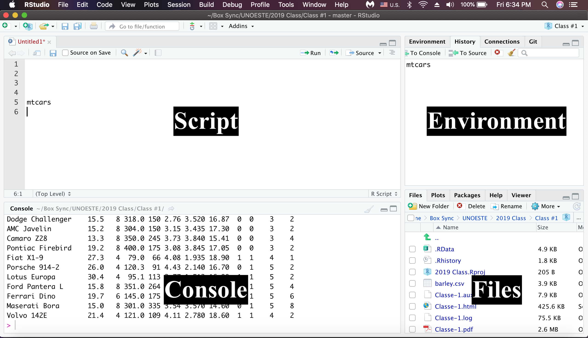

```{r include=FALSE}
library(tidyverse)
```


## Outline

::: columns

:::: column
- How to install R and Rstudio
\vspace{0.5cm}
- Intro to R, RStudio and Markdown
\vspace{0.5cm}
- Data types
\vspace{0.5cm}
- Importing datasets
::::

:::: column

```{r, echo=FALSE, fig.cap="", out.width = '100%', fig.align="center", fig.retina = 2, fig.pos='h'}

```

::::

:::

## Whats is R? RStudio?


- **R** – a programming language + software that interprets it
\vspace{0.5cm}

- **RStudio** – popular software to write R scripts and interact with the R software


##  Why learn R?

::: columns

:::: column
- Free, open source, cross platform 
  - 10,000+ “packages”
  - Works on many data types

- Statistical data analysis

- Produced high-quality graphics

- Reproducibility and repeatability 

- Write documents and manuscripts

::::

:::: column

```{r echo=FALSE, fig.align='center', fig.height=2, fig.width=2.5, warning=FALSE}
ggplot(mpg, aes(x=class, y=hwy, fill=class)) + geom_bar(width = .5, stat = "summary", fun.y = "mean", color="black") + coord_flip() + theme_bw() + theme(legend.position ="none") + labs(x="", y="highway mileage") + scale_fill_brewer(palette="Set1") + ylim(0,30)
```

::::

:::


## How to download R? RStudio?

::: columns

:::: column

- [**R**](https://www.r-project.org)

```{r, echo=FALSE, fig.cap="", out.width = '100%', fig.align="center", fig.retina = 2, fig.pos='h'}

```

::::

:::: column

- [**Rstudio**](https://rstudio.com)

```{r, echo=FALSE, fig.cap="", out.width = '100%', fig.align="center", fig.retina = 2, fig.pos='h'}

```

::::

:::

- [Video tutorial](https://www.youtube.com/watch?v=J7z1b9a9vps)


##  Setup a working directory

- Open RStudio

\vspace{0.5cm}

- *File* > *New project* > *New directory* > Empty project 
\vspace{0.5cm}
- Enter a name for this new folder: r-basics
\vspace{0.5cm}
- Choose a convenient location:
\vspace{0.5cm}
- ~/ is the Documents folder on the computer 
\vspace{0.5cm}
- Click “*Create project*”
 
##  Create a new R script


- File > New File > R script (.R or .Rmd)

- Save it in your project directory

- Look on the top left of the R Studio window to see where it’s saved


```{r, echo=FALSE, fig.cap="", out.width = '100%', fig.align="center", fig.retina = 2, fig.pos='h'}

```


##  RStudio interface


```{r, echo=FALSE, fig.cap="", out.width = '100%', fig.align="center", fig.retina = 2, fig.pos='h'}

```

##  Script vs Console

::: columns

:::: column

- Both accept commands
\vspace{0.5cm}
- Console: runs the commands
\vspace{0.5cm}
- Script: commands you want to save for later;
  - Must be run in console 
  - Ctrl+enter to run

::::

:::: column

```{r, echo=FALSE, fig.cap="", out.width = '100%', fig.align="center", fig.retina = 2, fig.pos='h'}
knitr::include_graphics("figures/ScriptConsole.png")
```

::::

:::

##  Let’s start coding!

- Operators: Arithmetic, assignment, extraction, logical
\vspace{0.5cm}
- Functions: names, arguments, output
\vspace{0.5cm}
- Data types: classes, vectors, data frames


##  Let’s start coding!


\begin{table}[]
\centering
\label{tab:my-table}
\resizebox{\textwidth}{!}{%
\begin{tabular}{ccc}
\hline
\textbf{Operators} & \textbf{What it does}                 & \textbf{Symbol}                         \\ \hline
Arithmetic      & Math on numbers                       & + - * / \textasciicircum{}              \\
Assignment      & Creates objects (left) with           & \textless{}-                            \\
Extraction      & Take out or replace part of an object & {[} {]} \$                              \\
Logical         & Compares values, returns TRUE/FALSE   & \textgreater \textless == ! \%in\% \& | \\ \hline
\end{tabular}%
}
\end{table}


##  Let’s start coding!

::: columns

:::: column

- Does math
  - Add: 2\textcolor{blue}{+}2 
  - Subtract: 3\textcolor{blue}{-}1 
  - Multiply: 4\textcolor{blue}{*}4
  - Divide: 5\textcolor{blue}{/}2
  \vspace{1cm}
- Sends results to the console 
  - CTRL+Enter

::::

:::: column

```{r, echo=FALSE, fig.cap="", out.width = '100%', fig.align="center", fig.retina = 2, fig.pos='h'}

```

::::

:::


##  Assignment operator

::: columns

:::: column

- Saves values into objects 
  - \textcolor{purple}{object} \textcolor{blue}{<-} \textcolor{green}{value} 
  - \textcolor{purple}{weightkg} \textcolor{blue}{<-} \textcolor{green}{55} 
  
\vspace{0.5cm}
- Overwrites previous values
\vspace{0.5cm}

- Combine with arithmetic operators: 
  - \textcolor{purple}{weightlb} \textcolor{blue}{<-} \textcolor{green}{2.2*weightkg}

::::

:::: column


```{r, echo=FALSE, fig.cap="", out.width = '100%', fig.align="center", fig.retina = 2, fig.pos='h'}

```


::::

:::

## Exercise 1: Operators

What are the values of each variable after each statement?

```{r}
mass <- 89  # mass?
```

```{r}
age <- 35  # age?
```

```{r}
mass <- mass * 2.0 # mass?
```

```{r}
age <- age - 20  # age?
```

```{r}
mass_index <- mass/age  #mass_index?
```


## Functions and arguments

::: columns

:::: column

- A sequence of instructions that perform a task
\vspace{0.5cm}
- Have names
\vspace{0.5cm}
- Accepts arguments (input)
\vspace{0.5cm}
- Return a value (output)

::::

:::: column

\begin{table}[]
\centering
\resizebox{\textwidth}{!}{%
\begin{tabular}{cc}
\hline
\textbf{Input}                     & \textbf{Output} \\ \hline
sqrt(9)                    & 3      \\
round(3.14159)          & 3      \\
round(x=3.14159, 2), digits=2 & 3.14      \\ \hline
\end{tabular}%
}
\end{table}

::::

:::

## Getting help

- Documentation

```{r}
?round # Opens a page for round
```

```{r}
args(round) # display arguments
```

- **Google "R + "function name"**

- Other websites 
  - [Stack overfolow (Q&A)](https://stackoverflow.com)
  - [R bloggers (tutorials)](https://www.r-bloggers.com)

## Data types 

- R guesses what type of data is sotred in an object

- Basic types:

     \textcolor{blue}{Numeric}
     
     \textcolor{blue}{Character}
     
     \textcolor{red}{Logical}
     
- Can be easy to tell

Examples:

  - x <- 32 (\textcolor{blue}{Numeric})
  
  - x <- "car" (\textcolor{orange}{Character})
  
  - x <- \textcolor{green}{TRUE} (\textcolor{red}{Logical})

\textcolor{orange}{data frame}
## Determing data type

- The class() function. Also used typeof()

```{r}
x <-32
y <- "car"
z<- TRUE
```

```{r}
class(x) # double or numeric
class(y) # character
class(z) # logical
```

## Data structures

\begin{table}[]
\centering
\label{tab:my-table}
\resizebox{\textwidth}{!}{%
\begin{tabular}{lll}
\hline
\textbf{Data structure} & \textbf{Description}                                        & Function                 \\ \hline
\textcolor{red}{vector}                  & Multiple values of the same type                            & c(), \textcolor{red}{vector}            \\
\textcolor{purple}{factor}                  & Multiple integers with text labels                          & \textcolor{purple}{factor}                 \\
\textcolor{orange}{data frame}              & Multiple vectors of the same length grouped to make columns & read.csv(), \textcolor{orange}{data frame} \\ \hline
\end{tabular}%
}
\end{table}

## Vector

- Most common data type

- Series of one data type

- Concatenate function: \textcolor{red}{c()}

    **Input**: values separately by commas
    
    **Output**: a vector object

```{r}
# Exemple: a list of yields
yield_ha <- c(3000, 2890, 3100, 2990) 
# Exemple: a list of cars
cars <- c("audi", "toyota", "ford")
```


## Inspecting vectors

- Vectors have characteristics:
  - **Length**: number of values
  - **Class**: type of values


```{r}
length(yield_ha)  # Try with length(cars)
```
```{r}
class(cars)      # Try with class(yield_ha)
```

```{r}
str(yield_ha)   # Try with str(cars)
```

## Adding values to a vector

- Use an existing vector as an argument to c()

- Put it in the order you want them to appear in the output vector

```{r}
# Add to the end of the vector
yield_ha <- c(yield_ha, 3315) 
```

```{r}
# Add to the beginning of the vector
yield_ha <- c(3050, yield_ha) 
```

##  Class coercion


- What happens if you mix types?

- R converts to a type that works for all elements

- Use *class()* to see what R picked


| Type      	| As character 	| As numeric 	| As logical 	|
|-----------	|--------------	|------------	|------------	|
| \textcolor{brown}{logical}   	| "\textcolor{green}{TRUE}"       	| 1          	| \textcolor{green}{TRUE}       	|
| \textcolor{blue}{numeric}   	| "35"         	| 35         	| NA         	|
| \textcolor{orange}{character} 	| "Nebraska"   	| NA         	| NA         	|

## Exercise 2: Vectors

- What types are these vectors?

```{r}
num_char <- c(1, 2, 3, "a") 
num_logical <- c(1, 2, 3, TRUE) 
char_logical <- c("a", "b", "c", TRUE) 
tricky <- c(1, 2, 3, "4")
```

Hint: use *class()*
 
## Factors


- Represent categorical data
  - Stored as integers with text labels
  - Data frames convert character columns to factors

- *factor()* - create a factor


- Create a character vector
```{r}
sex <- c("male", "female", "female", "male")
```

- Change vector to a factor
```{r}
sex <- factor(sex)
```


## Levels

- Unique text labels of a factor object

- *levels()* - displays labels

- *nlevels()* - displays number of levels

\begin{table}[]
\centering
\resizebox{\textwidth}{!}{%
\begin{tabular}{ll}
\hline
\textbf{Function}                                                                                           & \textbf{Output}  \\ \hline
levels(sex)                                                                                                 & “female”, “male” \\
nlevels(sex)                                                                                                & 2                \\
\begin{tabular}[c]{@{}l@{}}factor(sex,  levels = c("male", female")) \\            levels(sex)\end{tabular} & “male”, “female” \\ \hline
\end{tabular}%
}
\end{table}

## Exercise 3: Types

```{r}
ranks <- c("2", "5", "7", "3", "3") 
f_ranks <- factor(ranks) 
n_ranks <- as.numeric(f_ranks)
```

- What result do you expect to get?

- What do you get when you run the code?
 


##  Subsetting vectors

- Subset by position
- Syntax: square brackets [ ]
- Combine with c()

```{r}
animals<-c("cat", "dog", "pig") 
```

```{r}
animals[2] #Display second value
```

```{r}
animals[c(3,2)] #Display multiple values
```
```{r}
animals[c(1,2,3,2,1)] #Display repeated values
```


## Logical expressions


- Make comparisons
\vspace{0.5cm}
- Evaluates each element in a vector against a value
\vspace{0.5cm}

- Output: \textcolor{green}{TRUE} or \textcolor{red}{FALSE}
  - For each vector value

## Logical expressions

\begin{table}[]
\centering
\begin{tabular}{cc}
\hline
\multicolumn{1}{l}{Logical operator} & \multicolumn{1}{l}{Meaning} \\ \hline
\textcolor{blue}{$>$}                       & Greater than                \\
\textcolor{blue}{$<$}                          & Less than                   \\
\textcolor{blue}{==}                 & Equal to                    \\
\textcolor{blue}{!=}                 & Not equal to                \\
\textcolor{blue}{$\&$}               & and                         \\
\textcolor{blue}{|}                  & or                          \\
\textcolor{blue}{!}                  & not                         \\
\textcolor{blue}{\%in\% }            & Contained in                \\ \hline
\end{tabular}
\end{table}


## Example: logical expressions

- Create a weight variable:
```{r}
biomass_g <- c(22, 33, 37, 51, 59)
```

- Evaluate each weight:
```{r}
biomass_h <- biomass_g > 50
biomass_h
```

##  Conditional subsetting

- Keep \textcolor{green}{TRUE}, drop \textcolor{red}{FALSE}

- Input: a logical expression

- **Output**: vector with elements that match the logical expression

- Subset using \textcolor{green}{TRUE}/\textcolor{red}{FALSE} vector
```{r}
biomass_g[biomass_h]
```
- Same as
```{r}
biomass_g[biomass_g>50]
```

## Combining logical expressions

- Combine multiple conditionals

- \textcolor{blue}{|} = or (either)

- \textcolor{blue}{$\&$} = and (both)

- Biomass under 30 or over 50:
```{r}
biomass_g[biomass_g<30 | biomass_g>50]
```

- Biomass over 30 and under 50:
```{r}
biomass_g[biomass_g>30 & biomass_g<50]
```

##  Conditional subsetting: characters (==)

- \textcolor{blue}{==} operator

- Compares each value in a vector with a character string

- Combine with | for multiple

Make a character vector
\scriptsize
```{r}
crops <- c("corn", "soybean", "wheat", "alfalfa")
```

Crops that are corn
\scriptsize
```{r}
crops[crops=="corn"]
```
Crops that are corn or cats
\scriptsize
```{r}
crops[crops=="corn" | crops=="wheat"]
```


## Conditional subsetting: characters (%in%)

- **%in%** operator

- Selects elements of the first vector that are in the second vector

- **Input**: vectors

- **Output**: a \textcolor{green}{TRUE}/\textcolor{red}{FALSE} list

Which values in animals are in the right hand vector?
\scriptsize
```{r}
crops %in% c("corn", "soybean", "hemp", "wheat", "beans")
```

Use \textcolor{green}{TRUE}/\textcolor{red}{FALSE} vector to subset
\scriptsize
```{r}
crops[crops %in% c("corn", "soybean", "hemp", "wheat", "beans")]
```

## Missing data

- NA - harder to overlook missing data

- Argument: na.rm = TRUE
\scriptsize
```{r}
na.rm = TRUE #Ignores missing data
```

```{r}
heights <- c(2, 4, 4, NA, 6, 7) #create a dataset
```
\normalsize
- Mean of a missing value?

\scriptsize
```{r}
mean(heights)
```

- Remove the missing data
\scriptsize
```{r}
mean(heights, na.rm = TRUE)
```


## Remove missing data

\scriptsize
- is.na() - Returns \textcolor{green}{TRUE} if the value is NA

- complete.cases() - returns \textcolor{red}{FALSE} if missing

- na.omit() - returns object with missing values removed

**Remove NAs 3 ways:**

\scriptsize
```{r}
heights[!is.na(heights)]
```

\scriptsize
```{r}
heights[complete.cases(heights)]
```

\scriptsize
```{r}
na.omit(heights)
```


## Starting with data! 

- How to load data tables into R
\vspace{0.25cm}
-  Data set: barley yield in Minnesota, USA

::: columns

:::: column

- Stored in a **.csv** file
\vspace{0.25cm}
- **Rows**: observations of individual treatments
\vspace{0.25cm}
- **Columns**: Variables that describe the study
\vspace{0.25cm}
- factor() - create a factor

::::

:::: column

```{r, echo=FALSE, fig.cap="", out.width = '100%', fig.align="center", fig.retina = 2, fig.pos='h'}

```

::::

:::


## Tables to data frames

- Copy and paste barley.csv to your project folder

- **R** can read data tables

- Read tables using *read.csv()* or *read.csv2()*

- **Input**: a file name

- **Output**: table stored in a data frame

\tiny
```{r}
barley <- read.csv("barley.csv")
barley 
```

## Storing data in data frame

1 - Rows = observations 
\vspace{0.5cm}

2 - Columns = variables
\vspace{0.5cm}

3 - All values in a column must be the same data type
\vspace{0.5cm}

4 - Must have same # rows in each column


## Structure of a data frame

- A list of vectors

-  Each column
  - Is a vector
  - Has a name
  - Has a data type
  - Is a subject to coercion

- List: any data type - every column can have a different data type 

## Structure of a data frame

::: columns

:::: column

- Stored in a **.csv** file
\vspace{0.5cm}

- **Rows**: observations of individual treatments
\vspace{0.5cm}

- **Columns**: Variables that describe the study
\vspace{0.5cm}

- \textcolor{brown}{factor()} - create a factor

::::

:::: column

```{r, echo=FALSE, fig.cap="", out.width = '100%', fig.align="center", fig.retina = 2, fig.pos='h'}

```

::::

:::


## Inspecting data frames

\begin{table}[]
\centering
\label{tab:my-table}
\resizebox{\textwidth}{!}{%
\begin{tabular}{ll}
\hline
\textbf{Function} & \textbf{Output}                      \\ \hline
\textcolor{red}{class}             & Class of the object                  \\
\textcolor{red}{str}               & structure: \# rows, cols, data types \\
\textcolor{red}{dim}               & look at dimensions of data frame \\
\textcolor{red}{head}              & look at first 6 rows (all columns)   \\
\textcolor{red}{ls}                & list objects returning vector names   \\
\textcolor{red}{nrow/ncol}         & number of rows/columns               \\
\textcolor{red}{names}             & column names                         \\
\textcolor{red}{summary}           & summary stats for each column        \\ \hline
\end{tabular}%
}
\end{table}


## Subsetting data frames

- Use the extraction operator \textcolor{orange}{[   ]}

- Row column format: 
  \textcolor{orange}{data[row, column]}

- Select entire row/col:
  \textcolor{orange}{data[, column]}
  
- Ranges: 
  \textcolor{orange}{data[a:b, column]}

## Subsetting data frames

- First row, second col: 

\tiny
```{r}
barley[1,2]
```

- First row, all cols:  

\tiny
```{r}
barley[1,]
```

- Rows 1-3, 3 column:
\tiny

```{r}
barley[1:3, 3]
```

## Subsetting data frames

- First column, all rows:

\tiny
```{r}
barley[,3]
```


## Subsetting data frames

::: columns

:::: column

- barley["variety"]

- barley[, "variety"]

- barley[["variety"]]
  
- barley$variety

::::

:::: column

Result is a \textcolor{blue}{data.frame} 

Result is a \textcolor{red}{vector}

Result is a \textcolor{red}{vector} 

Result is a \textcolor{red}{vector}
 

::::

:::

## Exercise 4: Subsetting

1) Create a data frame (\textcolor{blue}{barley70}) containing only the observations from rows 1 to 70 of the surveys dataset.


2) Use *nrow()* to subset the last row in \textcolor{blue}{barley70}.


3) Use *nrow()* to extract the row that is in the middle \textcolor{blue}{barley70}. Store in a variable called \textcolor{purple}{barleymid}.


##  Saving Data as .csv

- \textcolor{blue}{write.csv()} or \textcolor{blue}{write.csv2()}
\vspace{0.5cm}

- Input: data frame, destination file
\vspace{0.5cm}

- Output: a file to the specified location
\vspace{0.5cm}

- \textcolor{blue}{write.csv}(x = \textcolor{blue}{barley70}, file = "\textcolor{blue}{barley70.csv}")


## Need help


- Base R Cheat sheet: [Link](https://rstudio.com/wp-content/uploads/2016/10/r-cheat-sheet-3.pdf)

\vspace{0.5cm}


- Thanks to Data Camp for sharing slides


