```{r include=FALSE}
library(tidyverse) 
library(knitr)
library(lattice)
```


## Outline

- What is literate programming?
\vspace{1cm}
- Why is it useful?
\vspace{1cm}
- How to use R Markdown to create reproducible reports
  - Text formatting
  - Code chunks
  - Output formats
 

## Literate programming

\centering human readable \textbf{\textcolor{red}{text}}

\vspace{0.5cm}

\centering +

\vspace{0.5cm}

\centering machine readable \textbf{\textcolor{red}{code}}

\vspace{0.5cm}

\centering =

\vspace{0.5cm}

\centering Reproducible \textbf{\textcolor{red}{document}}
 
 


## Programs as works of literature

- Developed by Donald Knuth, Stanford University
\vspace{1cm}
- \textbf{\textcolor{blue}{Traditional}}: telling a computer what to do
\vspace{1cm}
- \textbf{\textcolor{blue}{Novel}}: telling a human what you want the computer to do
\vspace{1cm}
- Improves documentation and the programs themselves
 

## Literate programming in research

::: columns

:::: column

- Tailor reports to an audience
\vspace{1cm}
- Repeatable and assures reproducibility
\vspace{1cm}
- Works well with version control
\vspace{1cm}
- Works well with languages used in research:

::::

:::: column

```{r, echo=FALSE, fig.cap="", out.width = '100%', fig.align="center", fig.retina = 2, fig.pos='h'}

``` 

\vspace{0.5cm}

```{r, echo=FALSE, fig.cap="", out.width = '50%', fig.align="center", fig.retina = 2, fig.pos='h'}

``` 


::::

:::


## R Markdown

::: columns

:::: column

- Weave narrative text and code
  - R
  - Python 
  - Stata
  - SAS
  
\vspace{1cm}
- Produce documents in many formats
\vspace{1cm}
- Reproducible

::::

:::: column

```{r, echo=FALSE, fig.cap="", out.width = '100%', fig.align="center", fig.retina = 2, fig.pos='h'}
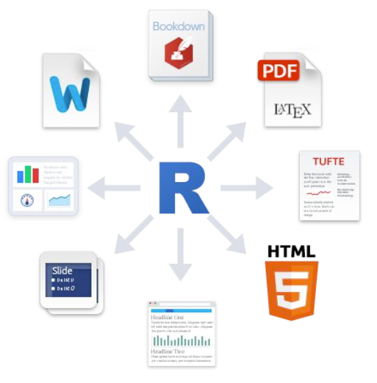
``` 


::::

:::


## Setup

::: columns

:::: column

- Tools > install packages
\vspace{0.5cm}

```
install.packages("markdown")
```

\vspace{0.5cm}
- Install TeX if you want create PDFs
\vspace{0.5cm}
- Open **R** project

::::

:::: column


```{r, echo=FALSE, fig.cap="", out.width = '100%', fig.align="center", fig.retina = 2, fig.pos='h'}
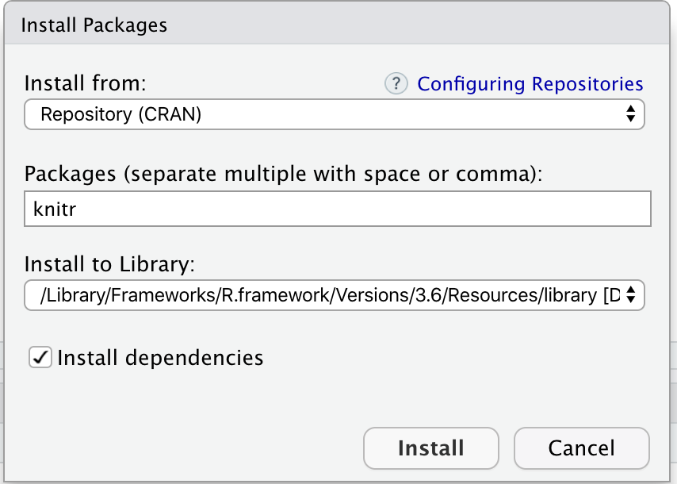
``` 


::::

:::


## Open/Create a markdown document


::: columns

:::: column

```{r, echo=FALSE, fig.cap="", out.width = '100%', fig.align="center", fig.retina = 2, fig.pos='h'}
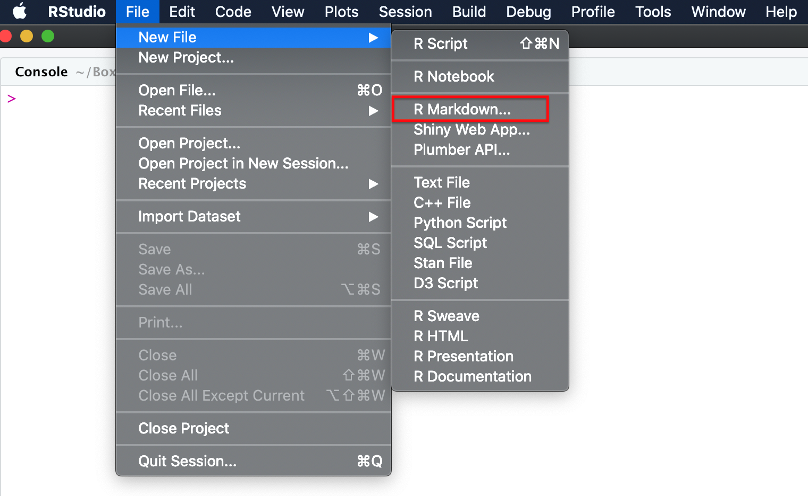
``` 


::::

:::: column


```{r, echo=FALSE, fig.cap="", out.width = '100%', fig.align="center", fig.retina = 2, fig.pos='h'}
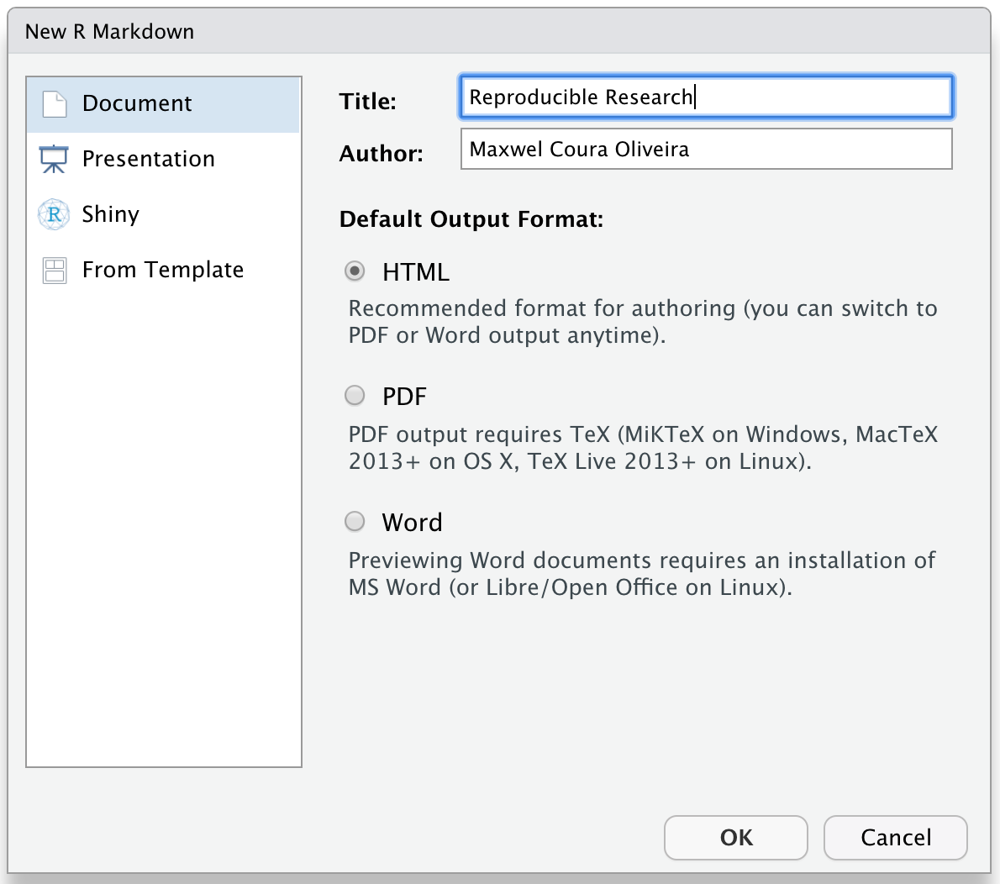
``` 


::::

:::


## Sections of R Markdown


```{r, echo=FALSE, fig.cap="", out.width = '100%', fig.align="center", fig.retina = 2, fig.pos='h'}
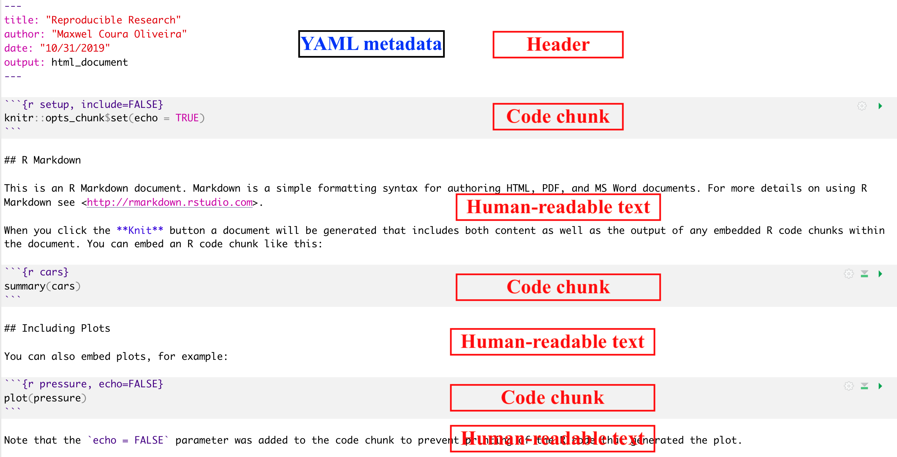
``` 


## Notebook interface

::: columns

:::: column

- Press \textcolor{green}{green} \textcolor{green}{triangle} on a code chunk to run the code and show the output
 

::::

:::: column

```{r, echo=FALSE, fig.cap="", out.width = '100%', fig.align="center", fig.retina = 2, fig.pos='h'}
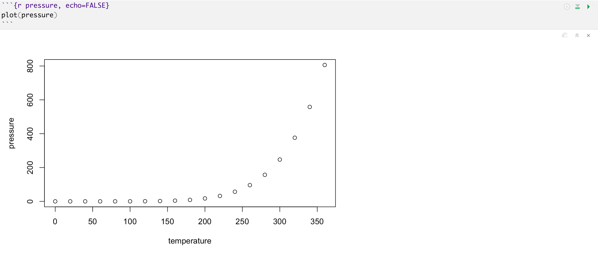
``` 


::::

:::


##  Knit: from text to document


::: columns

:::: column

render(input = “name.Rmd”, output = “html_document”)
\vspace{0.1cm}
**OR**
\vspace{0.1cm}
```{r, echo=FALSE, fig.cap="", out.width = '100%', fig.align="center", fig.retina = 2, fig.pos='h'}
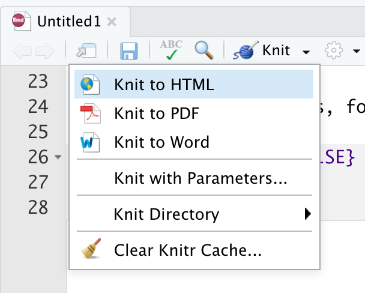
``` 


::::

:::: column

```{r, echo=FALSE, fig.cap="", out.width = '100%', fig.align="center", fig.retina = 2, fig.pos='h'}
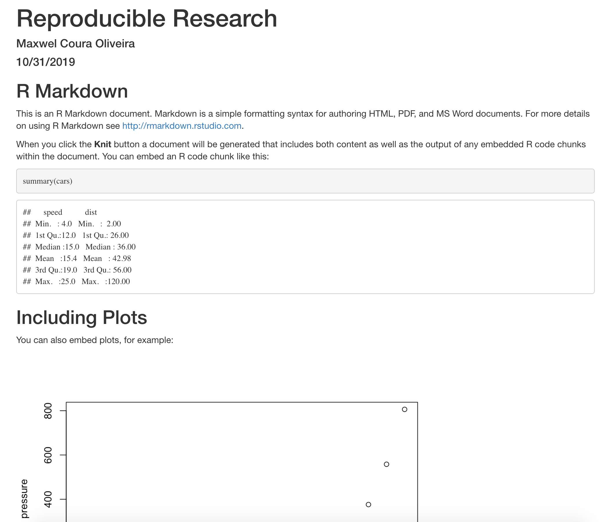
``` 


::::

:::


##  How it works


- knitr package converts the **R Markdown** document to markdown
\vspace{1cm}
- \textcolor{red}{Pandoc} converts the markdown document to the final

```{r, echo=FALSE, fig.cap="", out.width = '100%', fig.align="center", fig.retina = 2, fig.pos='h'}
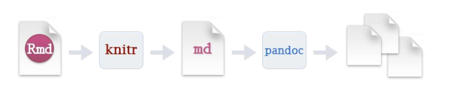
``` 


##  Human readable text


::: columns

:::: column

- Outline first, code 

\vspace{1cm}

- Use markdown rich formatting syntax to
\vspace{1cm}
- Cheat sheet: [Link](https://rstudio.com/wp-content/uploads/2015/02/rmarkdown-cheatsheet.pdf)

::::

:::: column

```{r, echo=FALSE, fig.cap="", out.width = '100%', fig.align="center", fig.retina = 2, fig.pos='h'}
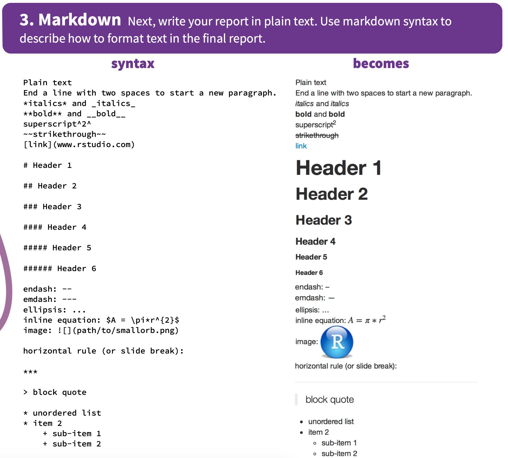
``` 


::::

:::


##  Adding code chunks


::: columns

:::: column

- Chunk delimiters
  - beginning: ```{r name}
    <code>
    
\vspace{1cm}

  - end: ```
\vspace{1cm}
- Shortkey: Ctrl+Alt+i 
\vspace{1cm}
- Editor toolbar
 


::::

:::: column

```{r, echo=FALSE, fig.cap="", out.width = '100%', fig.align="center", fig.retina = 2, fig.pos='h'}
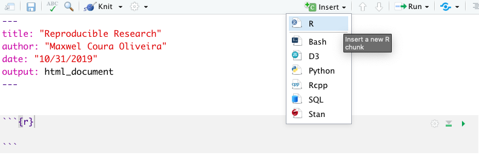
``` 


::::

:::


##  Setup code block

```
#load the libraries we need 
library(tidyverse) 
library(knitr)
library(lattice) #this is for the barley dataset
```

```{r }
data <- barley
```


##  Code chunk options


- \textcolor{red}{include} = FALSE
  + Hide code and results from document 
  + results can still be used later
  
\vspace{0.1cm}
- \textcolor{red}{echo} = FALSE
  + hides code, keeps result
  
\vspace{0.1cm}
- \textcolor{red}{message} = FALSE 
  + hides messages 
  
\vspace{0.1cm}
- \textcolor{red}{warning} = FALSE 
  + hides warnings
  
\vspace{0.1cm}
- \textcolor{red}{fig.cap} = " " 
  + adds figure captions
 


##  Setting options for all code chunks

- Set default options for all code chunks
\vspace{1cm}
- knitr::opts_chunk$set() function
\vspace{1cm}
- Put it in your first codeblock
\vspace{1cm}
- Must be after you load the rmarkdown package


## Tables

::: columns

:::: column


- Tables look like console output by default

- kable() function makes it pretty
 

\scriptsize
```{r}
nd <- barley %>% 
  group_by(site, year) %>% 
  summarize(mean = mean(yield))
```

::::

:::: column

\scriptsize
```{r}
kable(nd, digits=1)
```

::::

:::

##  Inline code


- Syntax `r`
\vspace{0.5cm}
- Include in test for responsive text
\vspace{0.5cm}
- Allows you to write one report and run it over changing datasets
\vspace{0.5cm}
- Example: mean


```{r, echo=FALSE, fig.cap="", out.width = '100%', fig.align="center", fig.retina = 2, fig.pos='h'}
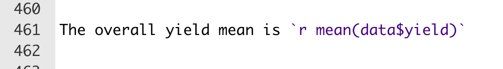
``` 


The overall yield mean is `r mean(data$yield)`


## Change output formats

::: columns

:::: column


- select output from knit menu
\vspace{1.5cm}
- Specify output in header
\vspace{1.5cm}
- with render
 

::::

:::: column


```{r, echo=FALSE, fig.cap="", out.width = '60%', fig.align="center", fig.retina = 2, fig.pos='h'}
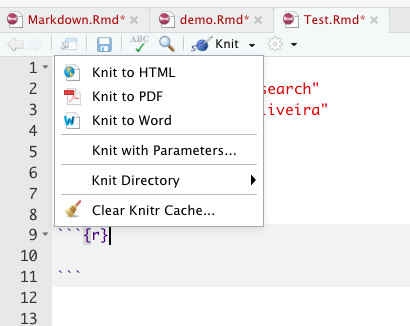
``` 

\vspace{0.5cm}

```{r, echo=FALSE, fig.cap="", out.width = '60%', fig.align="center", fig.retina = 2, fig.pos='h'}
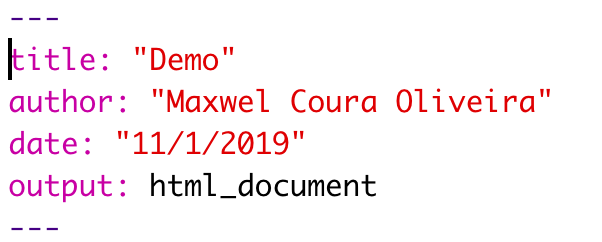
``` 

\vspace{0.5cm}

```{r, echo=FALSE, fig.cap="", out.width = '60%', fig.align="center", fig.retina = 2, fig.pos='h'}
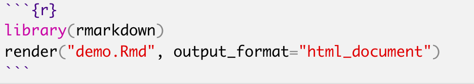
``` 

::::

:::


## Manuscripts

```
library(rticles)
```


```{r, echo=FALSE, fig.cap="", out.width = '100%', fig.align="center", fig.retina = 2, fig.pos='h'}
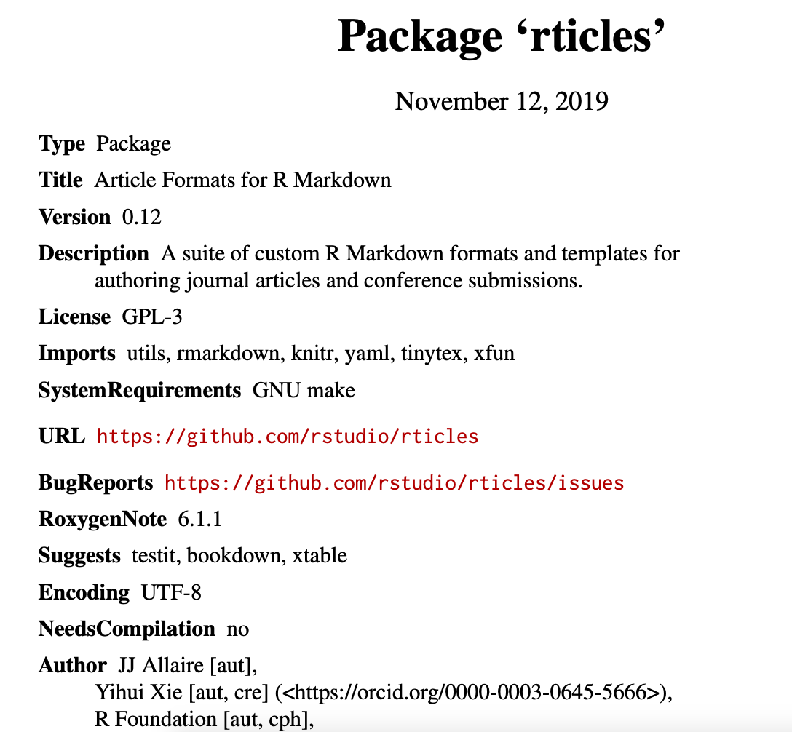
``` 

## Opening a template

::: columns

:::: column


- File > New File > R Markdown > From Template > **Template:**

\vspace{1cm}

- Choose *PLOS Journal Article*
 
```{r, echo=FALSE, fig.cap="", out.width = '60%', fig.align="center", fig.retina = 2, fig.pos='h'}

``` 

\vspace{1cm}

- Change name to \textcolor{purple}{Manuscript}

::::

:::: column


```{r, echo=FALSE, fig.cap="", out.width = '110%', fig.align="center", fig.retina = 2, fig.pos='h'}
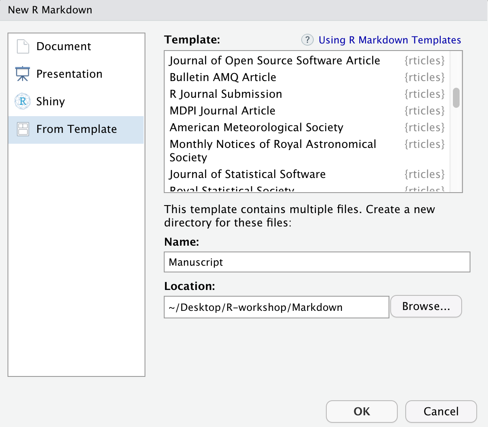
``` 

::::

:::


## New folders


::: columns

:::: column

- It creates a new folder name \textcolor{purple}{Manuscript}

```{r, echo=FALSE, fig.cap="", out.width = '100%', fig.align="center", fig.retina = 2, fig.pos='h'}
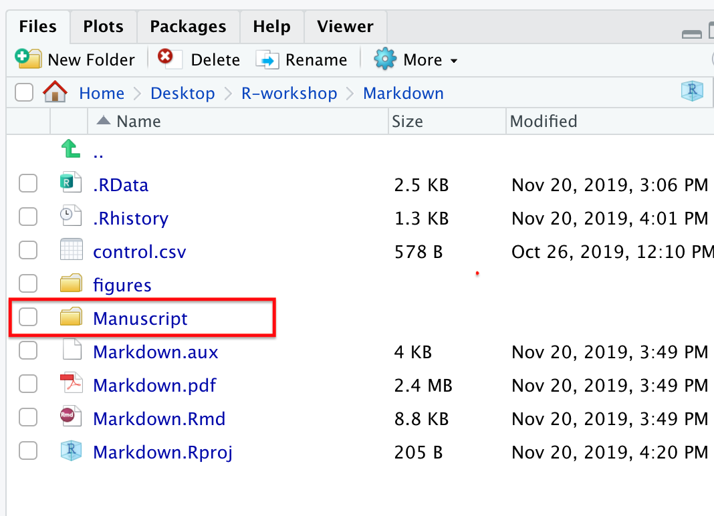
``` 


::::

:::: column

- \textcolor{purple}{Manuscript} > Rmd, bib, PLOS-submission.eps and plos.csl

```{r, echo=FALSE, fig.cap="", out.width = '100%', fig.align="center", fig.retina = 2, fig.pos='h'}
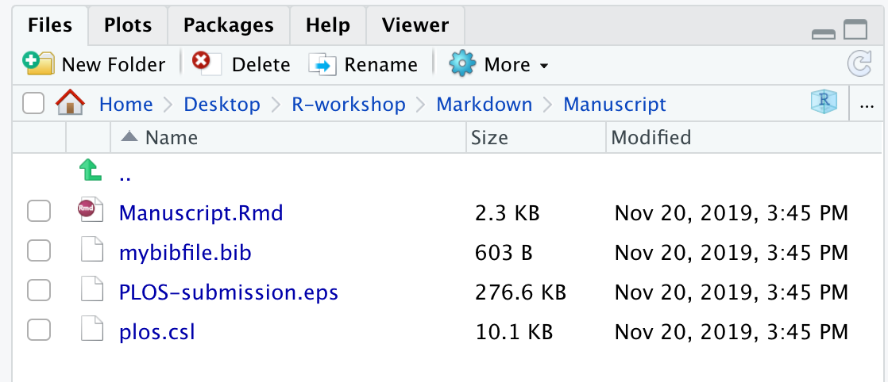
```

::::

:::

## PloS one template

- Rmarkdown template: the manuscript! 

```{r, echo=FALSE, fig.cap="", out.width = '100%', fig.align="center", fig.retina = 2, fig.pos='h'}
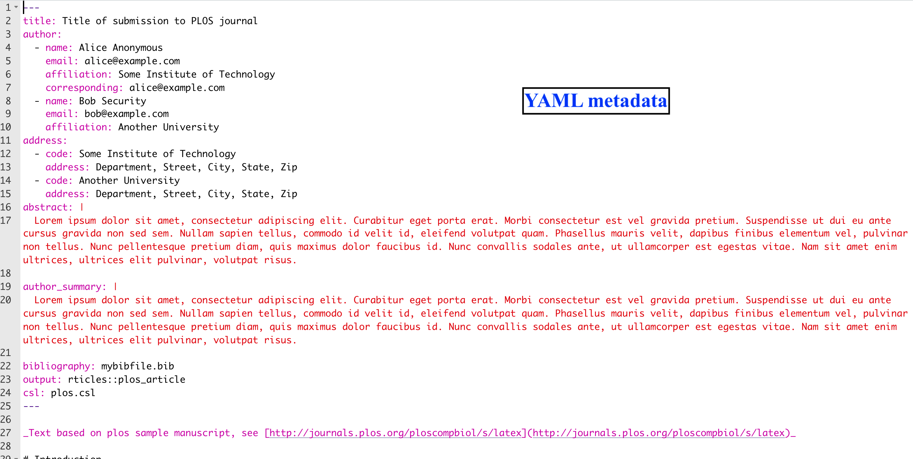
``` 


## Bibliography


::: columns

:::: column


- The word **BibTeX** stands for a tool and a file format which are used to describe and process lists of references, mostly in conjunction with LaTeX documents.


\vspace{0.5cm}

- Zotero is a free, easy-to-use tool to help you collect, organize, \textcolor{blue}{cite}, and share research.

::::

:::: column

```{r, echo=FALSE, fig.cap="", out.width = '100%', fig.align="center", fig.retina = 2, fig.pos='h'}

```

\vspace{0.5cm}

```{r, echo=FALSE, fig.cap="", out.width = '80%', fig.align="center", fig.retina = 2, fig.pos='h'}

```

::::

:::

## Zotero

- Right click in your citation folder

```{r, echo=FALSE, fig.cap="", out.width = '100%', fig.align="center", fig.retina = 2, fig.pos='h'}
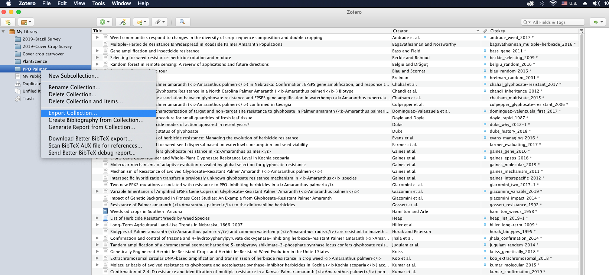
```

## Saving the bibliography


::: columns

:::: column

- Save as Better BibLaTeX

\vspace{1cm}

```{r, echo=FALSE, fig.cap="", out.width = '100%', fig.align="center", fig.retina = 2, fig.pos='h'}
knitr::include_graphics("figures/betterbib.png")
```

::::

:::: column

- Save your bib file in the same folder of your manuscript 

```{r, echo=FALSE, fig.cap="", out.width = '100%', fig.align="center", fig.retina = 2, fig.pos='h'}
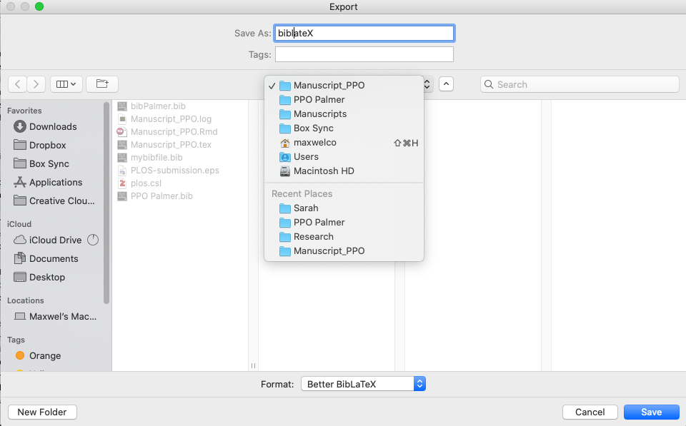
```

::::

:::


## Citation key

- Copy and paste citation key as: [@giacomini_variable_2019]

```{r, echo=FALSE, fig.cap="", out.width = '100%', fig.align="center", fig.retina = 2, fig.pos='h'}
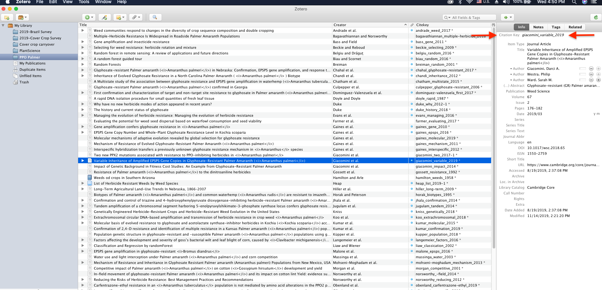
```


##  Summary


- Literate programming makes reproducible research more machine readable

- R markdown documents facilitate literate programming in RStudio

- R markdown has 3 sections
  - \textcolor{red}{Header}: determines output and adds parameters
  - \textcolor{red}{Markdown} \textcolor{red}{Text}: can include inline code
  - \textcolor{red}{Code} \textcolor{red}{chunks}: can be customized to mute code or output

- Manuscript templates
 


## Need help?

- Email: max.oliveira@wisc.edu

- R markdown cheatsheet: [Link](https://www.rstudio.com/wp-content/uploads/2015/02/rmarkdown-che atsheet.pdf)

- R markdown tutorial: [Link](https://rmarkdown.rstudio.com/lesson-1.html)

- Table generator: [Link](https://www.tablesgenerator.com)

