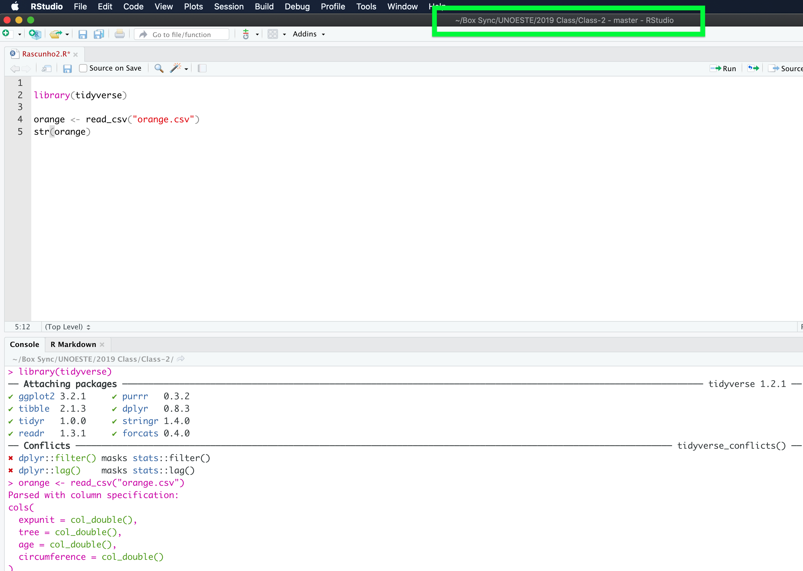
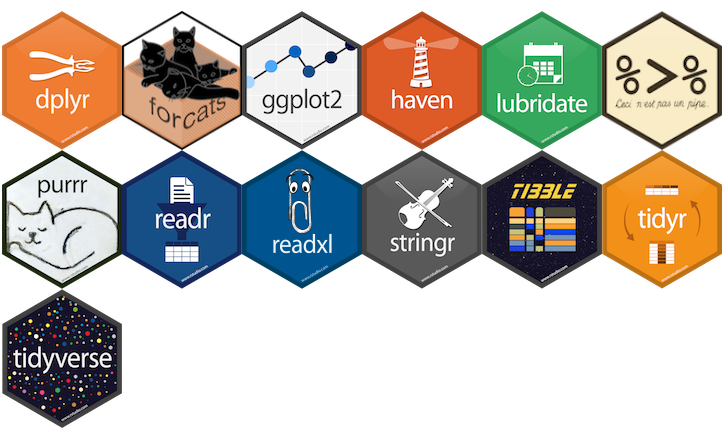
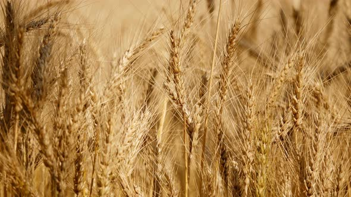
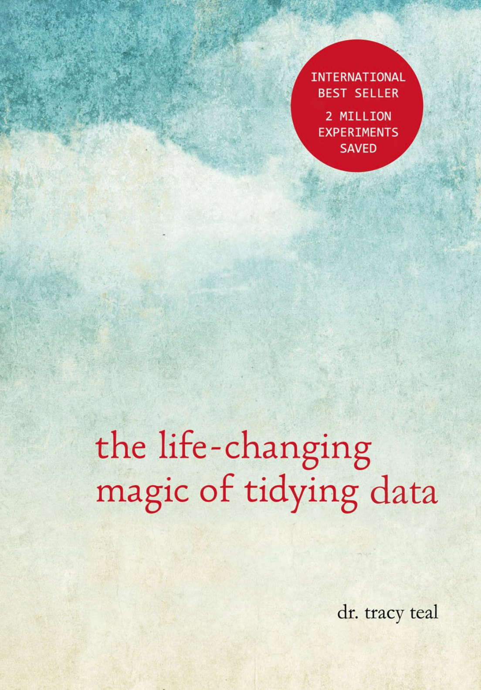
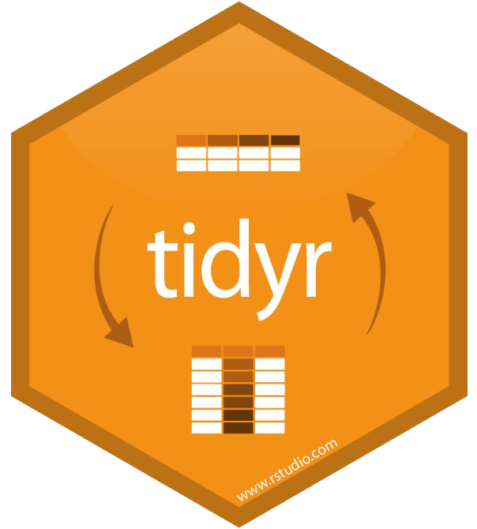
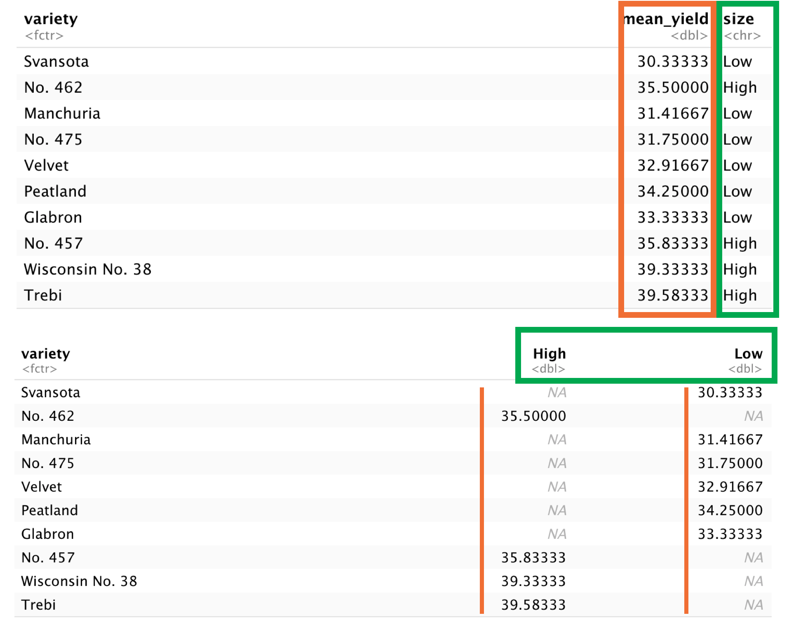
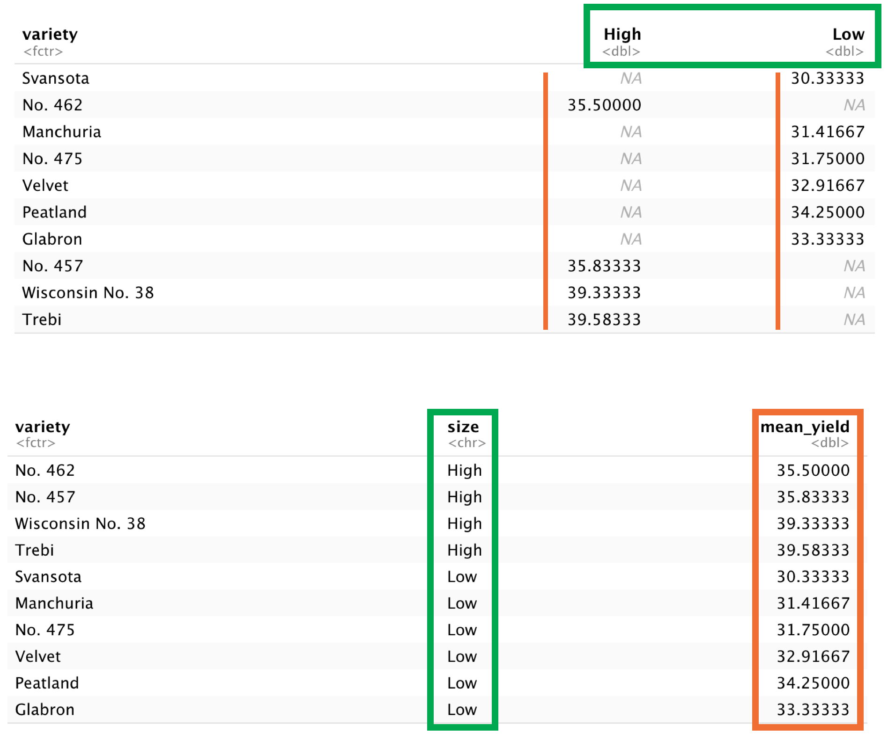

```{r include=FALSE}
library(tidyverse)
library(lattice)
```


## Outline

- 7 dplyr verbs for data manipulation
  - **select**, **filter**, **group_by**, **summarize**, **mutate**, **count**, **arrange**

\vspace{0.5cm}


- Combining verbs using pipes **%>%**

\vspace{0.5cm}
  
- 2 tidyr verbs to reshape your data (**spread**, **gather**)
 
  
##  Prerequisites
  
- Install R and R studio

\vspace{0.5cm}
  
- See the R basics lesson if you’re unfamiliar with R or R studio


##  Create a new R script

::: columns

:::: column

- **File > New File > R script**

\vspace{0.5cm}

- Save it in your project directory

\vspace{0.5cm}

- Look on the top left of the R Studio window to find project directory

::::

:::: column


```{r, echo=FALSE, fig.cap="", out.width = '100%', fig.align="center", fig.retina = 2, fig.pos='h'}

```


::::

:::


##  What is the tidyverse?

::: columns

:::: column

- Packages for data manipulation
\vspace{0.5cm}
- Built for data tables
\vspace{0.5cm}
- Makes data manipulation easier than in base R
\vspace{0.5cm}
- Combine verbs using pipes
 
::::

:::: column
 
```{r, echo=FALSE, fig.cap="", out.width = '100%', fig.align="center", fig.retina = 2, fig.pos='h'}

```
 
::::

:::


##  Installing packages

```
install.packages()
```
\vspace{0.5cm}
- Input: package name
\vspace{0.5cm}
- Downloads packages from CRAN (Comprehensive R Archive Network)
\vspace{0.5cm}
- Install once per machine

\scriptsize
```
install.packages("tidyverse")
```


## Loading packages

::: columns

:::: column

```
library(packagename)
```

\vspace{0.5cm}

- \textcolor{green}{Input}: package name

\vspace{0.5cm}

- Gives R access to functions in the package

\vspace{0.5cm}

- Load packages every time you restart R

::::

:::: column


```
library(tidyverse)
```


::::

:::


## Data set: barley yields in Minnesota 

::: columns

:::: column


- Stored in R as \textcolor{red}{barley} dataset at lattice package
\vspace{0.5cm}
```
library(lattice)
```
\vspace{0.5cm}
- *Rows*: observations of individual columns
\vspace{0.5cm}
- *Columns*: Variables that describe the experiment
  - yield, variety, year, site
  
::::

:::: column


```{r, echo=FALSE, fig.cap="", out.width = '100%', fig.align="center", fig.retina = 2, fig.pos='h'}

```


::::

:::

## barley data

\scriptsize

```{r}
barley
```


##  Import data in tidyverse


::: columns

:::: column


- *read_csv()* – loads contents of a CSV file

\vspace{0.5cm}
- *Input*: a \textcolor{orange}{file} path

\vspace{0.5cm}
- *Output* a “tibble”


::::

:::: column

\scriptsize

```{r include=FALSE}
barley
```

::::

:::

##  Why not read.csv()?


- read_csv() is faster

\vspace{0.5cm}

- Create tibbles

\vspace{0.5cm}

- More reproducible
 


\begin{table}[]
\centering
\label{tab:my-table}
\begin{tabular}{ll}
\hline
Data frame           & Tibble                       \\ \hline
Strings to factors   & Keeps character              \\
Has row names        & No row names                 \\
Changes column names & Keeps column nas as they are \\ \hline
\end{tabular}
\end{table}


## dplyr verbs

::: columns

:::: column

- First argument is always a table 
  - Tibble or data frame
  
\vspace{0.5cm}

- Output is a new table

\vspace{0.5cm}

- Doesn’t change input data
  - Must save the output using <-
  

::::

:::: column
  
new_df <- verb(old_df, ... )

\vspace{1cm}  

\textcolor{blue}{OR}

\vspace{1cm} 

old_df <- verb(old_df, ... )


::::

:::

##  select()

::: columns

:::: column

- Selects columns from a data frame
\vspace{0.5cm}

- Input: data and columns to be kept

\vspace{0.5cm}

- Output: data with only the specified columns


::::

:::: column


\tiny
```{r}
select(barley, site)
```


::::

:::


## filter()

::: columns

:::: column

- Choose rows based on values of a variable
\vspace{0.5cm}
- **Input**: data and a logical expression (returns true/false)
  - <, >, >=, <=, ==, !=
  
\vspace{0.5cm}

- **Output**: data with rows that match the expression

::::

:::: column

\tiny
```{r}
filter(barley, site == "Waseca")
```


::::

:::


## Pipe operator %>%


::: columns

:::: column

- Combine multiple verbs
\vspace{0.5cm}
- **Syntax**: %>% at the end of the line
\vspace{0.5cm}
- Output of the first line becomes input of next line, etc.
\vspace{0.5cm}
- Say it out loud as “then”

::::

:::: column

\scriptsize
```{r}
barley %>% 
  filter(yield > 50) %>% 
     select(site, yield)
```


::::

:::

##  Exercise #1: practice pipes

- Using pipes, subset the \textcolor{orange}{barley} data to include

\vspace{1cm}

-  **yield** of individuals higher than 40 and lower than 25 


##  mutate()


- Creates a new column
\vspace{0.25cm}
- \textcolor{green}{Input}: data and the definition of a new column
\vspace{0.25cm}
- col_name \textcolor{blue}{=} <value>
\vspace{0.25cm}
- \textcolor{purple}{Output}: data with a new column


\tiny
```{r}
barley %>% 
  mutate(yield_kgha = round(yield * 67.25, 0))
```


##  Exercise 2: data frame challenge

- Create a new data frame from the barley data that meets the following criteria:
 
  1. contains only the \textcolor{red}{site} and \textcolor{red}{yield} column and a new column called **yield_lb**
  
  2. **yield_lb** contains values that are yield in lb / 1000 sq. ft

\vspace{1cm}

- **Hint**: 1 bu/acre = 1.38 lb/1000 sq. ft 
 
```{r eval=FALSE, include=FALSE}
barley %>% 
  group_by(site, year) %>% 
  mutate(yield_lb = round(yield * 1.38, 0))
```

## Creating a summary table

::: columns

:::: column

- \textcolor{red}{summarize}()
\vspace{0.5cm}
- \textcolor{green}{Input}: data and a summary statistic

  - Eg: \textcolor{red}{mean}()
  
  - na.rm = \textcolor{green}{TRUE}
  
\vspace{0.5cm}

- \textcolor{purple}{Output}: a table with the calculated summary statistic

::::

:::: column

\tiny
```{r}
barley %>% 
  summarize(mean_yield = mean(yield, 
                             na.rm=TRUE))
```


::::

:::

## Creating a grouped summary table

::: columns

:::: column

- **group_by()**

\vspace{0.5cm}

- \textcolor{green}{Input}: data and a variable

\vspace{0.5cm}

- \textcolor{purple}{Output}: a table with the calculated summary statistic for each unique value in the variable

::::

:::: column

\tiny
```{r}
barley %>% 
  group_by(site) %>% 
  summarize(mean_yield = mean(yield, 
                             na.rm=TRUE))
```


::::

:::


## Removing missing values

::: columns

:::: column

- **is.na()**
  - missing = \textcolor{green}{TRUE}
  - not missing = \textcolor{red}{FALSE}

\vspace{0.5cm}
- \textcolor{green}{Input}: a column
\vspace{0.5cm}
- \textcolor{purple}{Output}: logical vector
\vspace{0.5cm}
- Use it as input to \textcolor{blue}{filter}()

::::
  
:::: column

\tiny
```{r}
barley %>% 
  filter(!is.na(yield)) %>%
  group_by(variety) %>% 
  summarize(mean_yield = mean(round(yield), 
                             na.rm=TRUE))
```


::::

:::


## count()

::: columns

:::: column

- Count the number of observations

\vspace{0.5cm}

- \textcolor{green}{Input}:
  - categorical variable
  
\vspace{0.5cm}
  
- **sort** = TRUE: sorts the results

\vspace{0.5cm}

- \textcolor{purple}{Output}: a table with a row for each categorical variable and a column called n with counts


::::
  
:::: column

\tiny
```{r}
barley %>% 
  count(site)
```

**Same as**

\tiny
```{r}
barley %>% 
  group_by(site) %>% 
  summarize(count=n())
```


::::
  
:::


## arrange()


::: columns

:::: column

- Order results in ascending order

\vspace{0.5cm}

- \textcolor{green}{Input}:
  - A variable
  - Use \textcolor{red}{desc}() to put them in descending order
  
\vspace{0.5cm}

- \textcolor{purple}{Output}: A table ordered by the values of the input column


::::
  
:::: column

\tiny
```{r}
barley %>% 
  group_by(variety) %>% 
  arrange(desc(yield))
```

::::
  
:::


##  Exercise 3


1 - Use **group_by()** and \textcolor{blue}{summarize}() to find the \textcolor{orange}{mean}(), \textcolor{orange}{min}(), and \textcolor{orange}{max}() \textcolor{purple}{yield} for each \textcolor{purple}{site}.


```{r eval=FALSE, include=FALSE}
barley %>% 
  group_by(variety) %>% 
  summarise(mean = mean(yield), min = min(yield), max = max(yield))
```

\vspace{1cm}

2 - **Bonus**: What is the yield gap between varieties in each site and location?

```{r eval=FALSE, include=FALSE}
barley %>% 
  group_by(variety, site) %>% 
  summarise(yield_gap = max(yield) -  min(yield))
```

## Reshaping data with tidyr

::: columns

:::: column

- The shape of your data affects what you can do with it

\vspace{1cm}

- **Example**: compare the mean \textcolor{blue}{yield} of each variety adding a new column (High or Low) 

::::
  
:::: column

\tiny

```{r, echo=FALSE, fig.cap="", out.width = '100%', fig.align="center", fig.retina = 2, fig.pos='h'}

```

::::
  
:::


## Exercise 

::: columns

:::: column

- Create a table with columns for \textcolor{purple}{variety} and **mean** \textcolor{purple}{yield}. Add a logical parameter for mean \textcolor{purple}{yield}, *>* 35 (High) or *<* 35 (Low)

\vspace{0.5cm}

- Save to a new object called **barley_nd**

::::
  
:::: column

\tiny
```{r}
barley_nd <- barley %>% 
  select(variety, yield) %>% 
  group_by(variety) %>% 
  summarise(mean_yield = mean(round(yield))) %>% 
  mutate(size = ifelse(mean_yield > 35,
                       "High", "Low"))
  
barley_nd
```


::::
  
:::


## Tidy Data


::: columns

:::: column

1) Each variable has its own column
\vspace{0.5cm}
2) Each observation has its own row
\vspace{0.5cm}
3) Each value has its own cell
\vspace{0.5cm}
4) Each type of observational unit forms a table
 


::::
  
:::: column


```{r, echo=FALSE, fig.cap="", out.width = '80%', fig.align="center", fig.retina = 2, fig.pos='h'}

```

::::
  
:::

## Reshaping data with tidyr


::: columns

:::: column

- \textcolor{blue}{Spreading}: makes a wider table
  - Unique values in a specified column (key) become variable names

\vspace{0.5cm}

- \textcolor{blue}{Gathering}: makes a longer table
  - Variable names become values in a new column (key)


::::
  
:::: column

\tiny

```{r, echo=FALSE, fig.cap="", out.width = '100%', fig.align="center", fig.retina = 2, fig.pos='h'}

```

::::
  
:::


## spread()


::: columns

:::: column

- use it when an observation is scattered across multiple rows

- \textcolor{orange}{Input}:
  - \textcolor{orange}{data} (a tibble)
  - \textcolor{orange}{key} column (values become new column names)
  - \textcolor{orange}{value} column (to fill new column variables)

- \textcolor{purple}{Output}: a table with columns for each value of sex


::::
  
:::: column

\tiny

```{r}
barley_spread <- barley_nd %>% 
  spread(key = size,
         value = mean_yield)

barley_spread
```


::::
  
:::


## Spread


```{r, echo=FALSE, fig.cap="", out.width = '70%', fig.align="center", fig.retina = 2, fig.pos='h'}

```


## gather()

::: columns

:::: column

- Use when column names are not names of variables, but values of a variable

- Input:
  - \textcolor{green}{data} (a tibble)
  - \textcolor{green}{key} column (created from col names)
  - values column (fill the key variable)
  - A range of columns to gather

- \textcolor{purple}{Output}: a long tibble


::::
  
:::: column


\tiny

```{r, warning=FALSE}
barley_gather <- barley_spread %>% 
  gather(key = size,
         value = mean_yield, 2:3, na.rm=TRUE)

barley_gather
```


::::
  
:::


## Gather


```{r, echo=FALSE, fig.cap="", out.width = '70%', fig.align="center", fig.retina = 2, fig.pos='h'}

```


## write_csv

::: columns

:::: column

- Writes a data table to a file

- \textcolor{green}{Input}: a tibble, a file path

-  \textcolor{purple}{Output}: a file at the specified file path


::::
  
:::: column


\scriptsize
```{r}
write_csv(barley_gather,
          path = "barley_2.csv")
```


::::
  
:::


## Need help

- E-mail: maxoliveira@wisc.edu

- Data Wrangling Cheat Sheet - [Link](https://rstudio.com/wp-content/uploads/2015/02/data-wrangling-cheatsheet.pdf)

- Thanks to Data Camp for sharing slides


